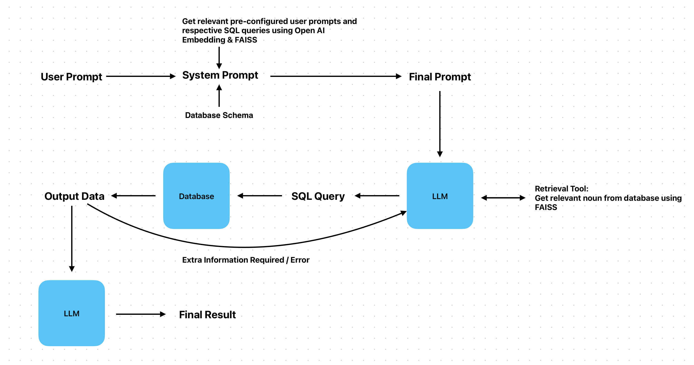

# DBbot

Intelligent chatbot for database querying.

Deployment: [Live Here!](https://db-bot.vercel.app)

## Description
- This project implements a chatbot interface that enables users to interact with a tabular database via natural language queries. The chatbot processes these queries, formulates appropriate SQL statements, and retrieves information from the database, presenting it in a user-friendly manner.

- The application uses OpenAI's GPT-3.5-turbo model to convert user queries into SQL commands and execute them against the database.

## Documentation

### Local Configuration

#### Frontend
```bash
# Install dependencies
cd frontend
npm install

# Run the React application
npm run dev
```

#### Backend

Configure the openai api key in the ```backend/app.py``` at line 28 as ```OPENAI_API_KEY="sk-......yourkey"```.

```bash
# Setup virtual environment and install dependencies
cd backend
python -m venv env
source env/bin/activate
pip install -r requirements.txt

# Run the Flask application
flask run --port 8888 --debug
```

### Flow



### Objectives:
- Simple chat interface. (Similar to ChatGPT)
- Querying an open-source tabular database with numbers & text.

### Requirements:
- User Friendly Interface
- Tabular database with sample data
- Intelligent Query Capability + Training the platform

### Additional Features:
- [x] View executed SQL queries
- [x] Markdown Support
- [x] Self correction in case of error
- [x] Visual representation of data
- [ ] History of conversations
- [ ] Learning through user feedback
- [ ] Multiple LLM/Bots options to choose from

### Tech Stack:
- Frontend:
    - React
    - Tailwind CSS
- Backend:
    - Flask
- Database:
    - SQLite

### Application Structure:
#### Backend (Flask)
The Flask application sets up an API endpoint '/chat' that accepts 'GET' requests with a message parameter. The message is processed by the OpenAI model to generate an SQL query, which is then executed against the SQLite database. The response includes both the natural language response and the SQL query.

#### Frontend (React)
The React application provides a chat interface where users can input their queries. Messages from the user and responses from the bot are displayed in a chat-like format. The frontend communicates with the backend API to fetch responses and display the executed SQL queries.

### Libraries Used:
#### Python (Backend)
- openai: Library for interacting with OpenAI's GPT-3.5-turbo model.
- sqlite3: SQLite database adapter for Python.
- ast: Provides functions to process abstract syntax trees.
- re: Module for regular expressions in Python.
- langchain_openai: Interface for using OpenAI's models within LangChain.
- langchain_community: Community tools for LangChain, including agent toolkits and utilities.
- langchain_core: Core components for building and running LangChain applications.
- FAISS: Facebook AI Similarity Search, a library for efficient similarity search and clustering of dense vectors.

#### React (Frontend)
- react: JavaScript library for building user interfaces.
- axios: Promise-based HTTP client for the browser and Node.js.
- marked: Library for parsing Markdown.

#

## Relevant Resources:
- [SQL Agents - LangChain](https://python.langchain.com/v0.1/docs/use_cases/sql/agents/)

- [SQLDatabaseChain Tutorial](https://github.com/bhattbhavesh91/langchain-crashcourse/blob/main/sql-agent-notebook.ipynb)

- [Chat with MySQL Database](https://youtu.be/YqqRkuizNN4?si=6dNIEt4oitMyUqGs)

- [Chat with MySQL Database with Python | LangChain](https://youtu.be/9ccl1_Wu24Q?si=WhOcMZIyIpMH6K5g)

- [Creating a Chatbot Based on ChatGPT for Interacting with Databases](https://www.clearpeaks.com/creating-a-chatbot-based-on-chatgpt-for-interacting-with-databases/)

- [Connect LLM to SQL Database with LlamaIndex](https://www.restack.io/docs/llamaindex-knowledge-connect-llm-to-sql-database-llamaindex#clvn95w410eznhjp2nj57343t)

- [LlamaIndex Text-to-SQL](https://colab.research.google.com/github/jerryjliu/llama_index/blob/main/docs/docs/examples/index_structs/struct_indices/SQLIndexDemo.ipynb#scrollTo=1c09089a-6bcd-48db-8120-a84c8da3f82e)

- [How we built Text-to-SQL at Pinterest](https://medium.com/pinterest-engineering/how-we-built-text-to-sql-at-pinterest-30bad30dabff)

- [RAG2SQL at Vanna.ai ](https://angelina-yang.medium.com/no-more-text2sql-its-now-rag2sql-760742c78b80)

## Examples:
- [WrenAI](https://www.getwren.ai/)
- [Vanna.AI](https://vanna.ai/)
- [TEXT2SQL.AI](https://www.text2sql.ai/)
- [EverSQL](https://www.eversql.com/text-to-sql/)

## Credits
- UI Library: [HyperUI](https://www.hyperui.dev/)
- Code-Blocks for SQL code display: [react-code-blocks](https://github.com/rajinwonderland/react-code-blocks)
- Database: [Indian Premier League SQLite Database](https://www.kaggle.com/datasets/harsha547/ipldatabase)